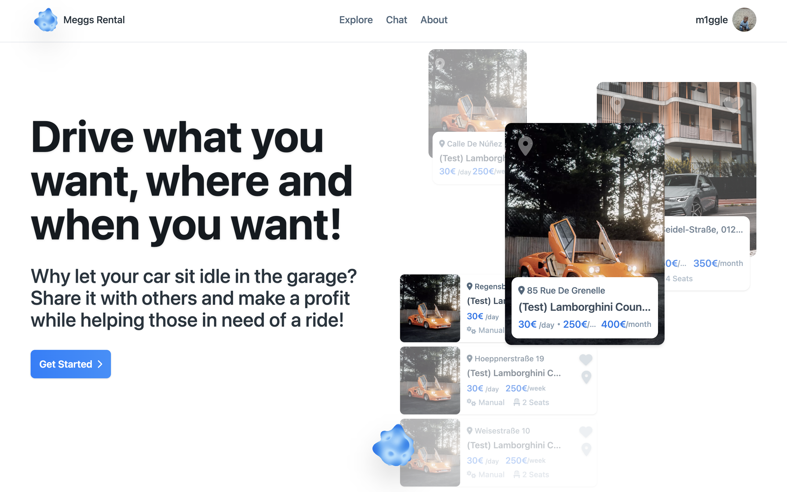

# Meggs Rental Website

Welcome to the future of car sharing! Meggs Rental is a website that allows car owners to put their unused vehicles to good use and make money from it. You can offer your car to others who might be in need of a ride and chat with them to discuss the details of the offer. Say goodbye to letting your car collect dust in the garage, and join us today for a seamless car sharing experience!

The website is built using React.js, TailwindCSS, and Mapbox. 

For more information about the website, how it was built, and to see additional projects, please visit my personal website at https://megglebande.netlify.app/.

## Getting Started

To start the project, please follow the steps below:
1. please note that all the secretes are missing, meaning the project won't start. Contact me to get all the necessary secrets.
2. Download the project as a zip file from the repository.
3. Extract the zip file.
4. Open the terminal in the extracted folder.
5. Run `npm start`. Please note that all secrets are missing from the project. If you need them, please contact me.

The website should now be running and accessible at `http://localhost:3000/`.

## Issues and Recommendations

If you encounter any bugs or have any recommendations for improvements, please create an issue on the repository. I appreciate any feedback and will do my best to address any issues that are raised.

## Contact

If you have any inquiries or would like to reach out to me, please feel free to send me an email at max.mustermann@web.de. I look forward to hearing from you!

## Website Availability

Meggs Rental website is currently live and can be accessed at https://meggsrental.netlify.app/. 

## Additional Information

### Available Scripts

In the project directory, you can run:

`npm start`

Runs the app in the development mode.\
Open [http://localhost:3000](http://localhost:3000) to view it in your browser.

The page will reload when you make changes.\
You may also see any lint errors in the console.

`npm test`

Launches the test runner in the interactive watch mode.\
See the section about [running tests](https://facebook.github.io/create-react-app/docs/running-tests) for more information.

`npm run build`

Builds the app for production to the `build` folder.\
It correctly bundles React in production mode and optimizes the build for the best performance.

The build is minified and the filenames include the hashes.\
Your app is ready to be deployed!

See the section about [deployment](https://facebook.github.io/create-react-app/docs/deployment) for more information.

`npm run eject`

**Note: this is a one-way operation. Once you `eject`, you can't go back!**

If you aren't satisfied with the build tool and configuration choices, you can `eject` at any time. This command will remove the single build dependency from your project.

Instead, it will copy all the configuration files and the transitive dependencies (webpack, Babel, ESLint, etc) right into your project so you have full control over them. All of the commands except `eject` will still work, but they will point to the copied scripts so you can tweak them. At this point you're on your own.

You don't have to ever use `eject`. The curated feature set is suitable for small and middle deployments, and you shouldn't feel obligated to use this feature. However we understand that this tool wouldn't be useful if you couldn't customize it when you are ready for it.
